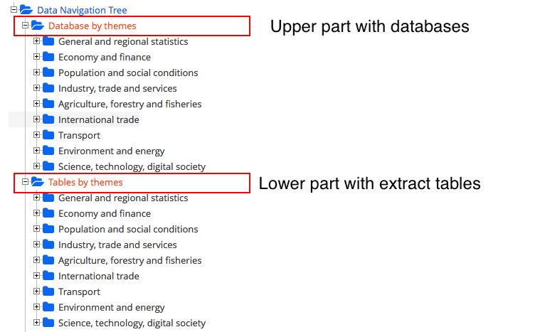
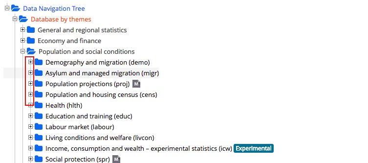
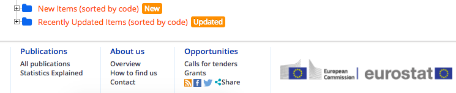
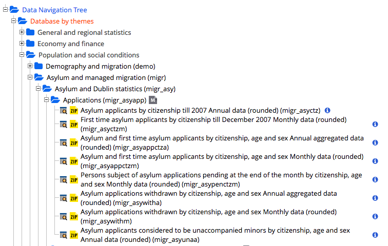
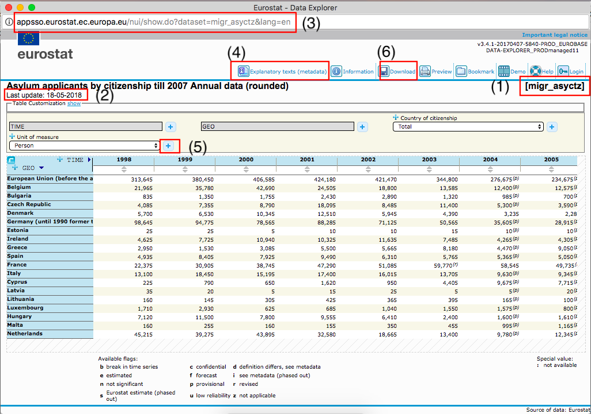
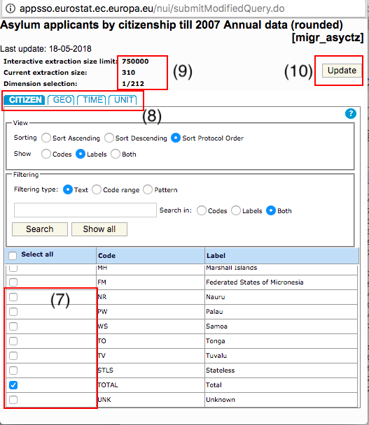

# Data sources

Link to this page: http://bit.ly/ddj-data-sources

## Collections

[ProPublica](https://www.propublica.org/) has published all its datasets in use in the [**ProPublica Datastore**](https://www.propublica.org/datastore/) so you can tell your own story with it.

[Quartz](https://qz.com/) has created this [**Directory of Essential Data**](https://docs.google.com/spreadsheets/d/1hU7Snj4KZ-ppyy388l-sV4I26n4yGVb8xYnygPOS-5k/edit#gid=0) that gives a topic-wise overview of data source options.

Does my country have an **Open Data** Portal I could source? [Data Portals](http://dataportals.org/) by the [Open Knowledge International](https://okfn.org/) has you covered.

With his newsletter [Data is Plural](https://tinyletter.com/data-is-plural) data journalist [Jeremy Singer-Vine](https://twitter.com/jsvine) creates a growing **list of interesting datasets** - you can check out the newsletter's archive [here](https://docs.google.com/spreadsheets/d/1wZhPLMCHKJvwOkP4juclhjFgqIY8fQFMemwKL2c64vk/edit).

[**Our World in Data**](https://ourworldindata.org/) by [Max Roser](https://twitter.com/MaxCRoser) is not only a great starting point to find topic-based data sources, but also to see how data visualizations and text can go together.

[**Pew Research Dataset Collection**](http://www.pewresearch.org/download-datasets/) holds survey data on different topics like US politics, public life, journalism and media and social and demographic trends.

[**Data World**](https://data.world/) aims at being social platform and data sharing tool at once - sometimes it holds great finds.

## Data by internationally operating organisations (under construction, tbc)

**General**

[FAO Data](http://www.fao.org/faostat/en/#data): The Food and Agriculture Organization of the UN holds information on food security, agriculture, land use, fishery, lands rights, agricultural market information and much more. Here's an [overview of their databases](http://www.fao.org/statistics/databases/en/).

[OECD Data](https://data.oecd.org/) and [OECD Data Lab](http://www.oecd.org/statistics/datalab/) is also worth checking out

[UN Data](http://data.un.org/) pools data of all UN agencies; but sometimes it's worth it to check out the specific agency website as it might hold more up-to-date information.

[World Bank Data](https://data.worldbank.org/)

[World Resoure Institute's Maps and Data section](http://www.wri.org/resources) has both, datasets you can work with as well as already produced datavisualizations 

**Health**

[WHO Data Repository](http://apps.who.int/gho/data/node.home)

**Environment, disasters**

[UNEP Environmental Data Explorer](http://geodata.grid.unep.ch/)

[UNSIDR](https://www.unisdr.org/we/inform/disaster-statistics), the UN's office for Disaster Risk Reduction collects data on disasters from various sources, among them the above mentioned EM-DAT.

[USGS](https://earthquake.usgs.gov/), the US Geological Service, provides data on earthquakes [in various forms](https://earthquake.usgs.gov/data/)

[NOAA data catalogue](https://data.noaa.gov/datasetsearch/) holds more than 60,000 datasets, not only confided to the US. NOAA also collects [global CO2 data](https://www.esrl.noaa.gov/gmd/dv/data/index.php?parameter_name=Carbon%2BDioxide), and you can find data on [sea level rise](https://tidesandcurrents.noaa.gov/sltrends/sltrends.shtml) here as well. [Here's](https://www.ncdc.noaa.gov/data-access) an overview of what different data are collected. They also provide [an archive](https://www.ncdc.noaa.gov/cdo-web/) for historical data.

[NASA](https://data.nasa.gov/) offers different entry points to their dataverse, depending on your proficiency. They also have a [searchable interface](https://data.nasa.gov/browse) as gateway to more than 40,000 entries.

[EM-DAT](https://www.emdat.be/) is a database on natural and technological disasters; it's related to [CE-DAT](http://cedat.be/) which holds information on epidemiological disasters but unfortunately isn't public anymore. 

**Violence, war, weapons**

[Global Terrorism Database](https://www.start.umd.edu/gtd/) by the University of Maryland collects information on terrorism incidents since 1970.

[SIPRI](https://www.sipri.org/databases) has information on arms industry, military expenditure and weapons trade. 

## Data by region (under construction, tbc)

[PARLgov](http://www.parlgov.org/) contains results of elections within Europe.

**European Union: datasets**

When it comes to data concerning the member states of the European Union, there are two main databases you should know.

My first go-to place is the [**Eurostat database**](http://ec.europa.eu/eurostat/data/database)

Note that it has two different sections, the upper part containing links to the actual databases, whereas the lower part contains tables that are aggregates of the upper part and lack an overview of what more indicators are possibly listed in the dataset. 

So I always would suggest to use the database-part. This part is sorted by themes and you can click on the little plus signs to get a more detailed overview of what entries are contained.

At the very bottom of the tree, there are two important dropdowns
"Newly added datasets" and "Recently updated datasets". I guess both titles are self-explanatory.

If you clicked on as many plus signs as possible down to the lowest level, each entry has a little table icon and a yellow zip icon in the front, and a blue info icon at the end. If you click on the latter you get an info sheet with an overview of the timespan covered and info when it was last updated. At the end of each title you have in parenthesis the unique identifier for this dataset, that's crucial to trace it back.
If you click on the first table icon, you are redirected to the database entry. 

When you are in an entry, there are several important elements. 1) The unique identifier that you should keep track of to refind your dataset. 2) Information on when this dataset was last updated. 3) The URL that contains the unique identifier and allows you to refind the table 4) Metadata, containing detailed information on definitions and possible breaks in time series for example. 5) Plus signs that allow you to add more data from the database to your selection 6) the download area, once you have selected all the data you need.

Within the entry, only a selection of what is in the database is displayed to you. If you click on the download button, only variables that are contained in the dropdowns are downloaded. If you want to add more, you can click on any of the plus signs and you'll be transferred to the updating dialogue, where you see what all the possible data are that you can get -- (7) tick the boxes of the variables you want to be contained in your download. You can use the tabs (8) to navigate through the other parameters and their variables without leaving this dialogue overlay. When the font in the header area (9) turns read you have selected more variables than can be downloaded at one time. Click (10) the update button to refresh the table with all your newly selected variables.

There's an **API** you can use to query the database, you can find more information [here](http://ec.europa.eu/eurostat/web/sdmx-web-services/rest-sdmx-2.1)

Alternatively, you could also build a request/post or selenium scraper that runs regularly, as the URLs for each database entry are structured similarly. You just have to replace the unique identifier after `dataset=` in the url

`http://appsso.eurostat.ec.europa.eu/nui/show.do?dataset=migr_asyctz&lang=en`

Other than the Eurostat database, the second important database is the [**EU Open Data Portal**](http://data.europa.eu/euodp/en/data). It pulls data from Eurostat, but also datasets from other EU agencies. Contrary to the above Eurostat tree of datasets, here you have to know a search term to look for (apart from things like 'most popular' for example)

This one too has an **API** to query the database, you can find information on how to do that [here](http://data.europa.eu/euodp/en/developerscorner)

**European Union: geospatial information**: [Explainer on different "NUTS" levels](http://ec.europa.eu/eurostat/web/nuts), various [national structures existing in the EU countries](http://ec.europa.eu/eurostat/web/nuts/national-structures-eu), their [relation to post codes](http://ec.europa.eu/eurostat/web/nuts/correspondence-tables/postcodes-and-nuts), plus an [overview of available geoinformation](http://ec.europa.eu/eurostat/web/gisco/geodata/reference-data/administrative-units-statistical-units) and finally: actual [geodata in different formats](http://ec.europa.eu/eurostat/de/web/gisco/geodata/reference-data/administrative-units-statistical-units/nuts).
And because none of the above really explains the EU file nomenclature:

NUTS_AT files -- contain an overview with NUTS_IDs, country codes, and region names (in NUTS, Latin, ASCII and HTML spelling - beware, encoding issues ahead. In English language system settings you can open them via import and file encoding "windows lating 1")

NUTS_LB files -- locate cities

NUTS_BN files -- have the border lines as lines and not as polygons

NUTS_RG files -- is what you need if you want to make a choropleth map of Europe. It contains polygons of the different European geospatial units.

## Data by country (under construction, tbc)

Eurostat lists [contact details and release calendars](http://ec.europa.eu/eurostat/web/links/national_statistical_offices) for each member state's statistics office

| Country     | Statistical Office    | GEO Information    | Further     		|
|-------------|-----------------------|--------------------|--------------------|
| Germany	  | [Destatis](https://www-genesis.destatis.de/genesis/online/logon?language=en)			  | [Geodatenzentrum](http://www.geodatenzentrum.de/geodaten/gdz_rahmen.gdz_div?gdz_spr=eng&gdz_akt_zeile=5&gdz_anz_zeile=1&gdz_unt_zeile=0&gdz_user_id=0)| [Police Crime Statistics](https://www.bka.de/EN/CurrentInformation/currentinformation_node.html)

## Meta

[ProPublica's Guide to bulletproof your data](https://github.com/propublica/guides/blob/master/data-bulletproofing.md)

[Quartz Guide to Bad Data](https://github.com/Quartz/bad-data-guide)

##### Usage and license
*Compiled by [@giannagruen](twitter.com/giannagruen).* 
*Feel free to use, share, edit these collections for non-commercial use under [CC BY-NC-SA 4.0](https://creativecommons.org/licenses/by-nc-sa/4.0/) license. For purposes not covered under that license, please feel free to get in touch via the above mentioned email.*